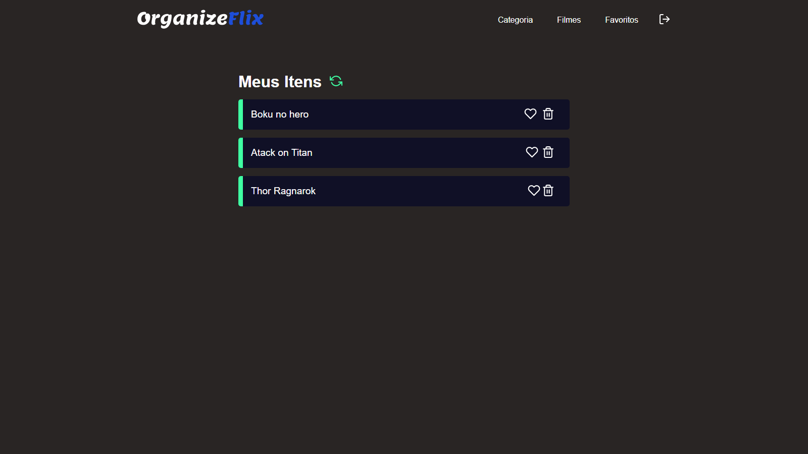
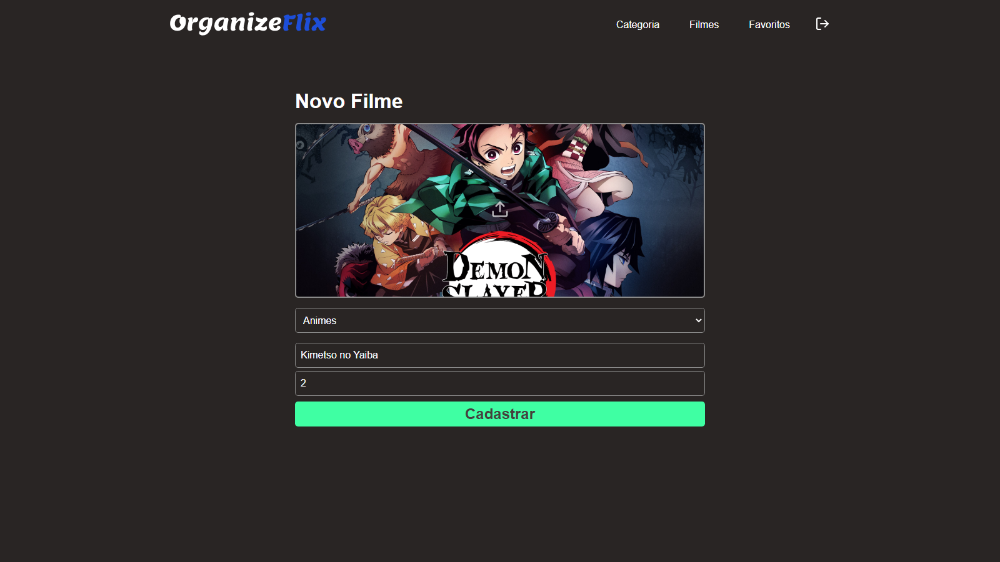

 <p align='center'></p>

 <h1 align="center">Organize Flix</h1>

 <p align='center'>


 
</p>

## 🚀 Tecnologias
Esse projeto está utilizando as seguintes tecnologias:
    

- [React](https://pt-br.reactjs.org/)
- [Node](https://nodejs.org/en/)
- [Typescript](https://www.typescriptlang.org/)  
- [Next](https://nextjs.org//)  


## ⚙️ Funcionalidades
- Sistema de cadastro e login de usuários;
- Criar novas categorias;
- Listar filmes por categoria;
- Cadastrar novos filmes;
- Envio de imagem para logo do filme;
- Deletar filme;
- Adicionar e remover dos favoritos;

## 🎲 Como utilizar
### Clone esse repositório
```bash
git clone https://github.com/Savio-Anjos/Organize-Flix.git

```
### Navegue até o diretório backend
```bash 
cd backend
```

### Instale as dependências
```bash
npm i
```
```bash
yarn
```

### Inicie o servidor
```bash
yarn dev
npm run dev
```

### Navegue até o diretório frontend
```bash 
cd frontend
```

### Instale as dependências
```bash
npm i
```
```bash
yarn
```
### Inicie a aplicação Web
```bash
yarn dev
npm run dev
```

## 🖼️ Layout



---
<p>Criado com 💙 por <a href='https://github.com/Savio-Anjos/' target='_blank'>Sávio Anjos</a></p>


 
